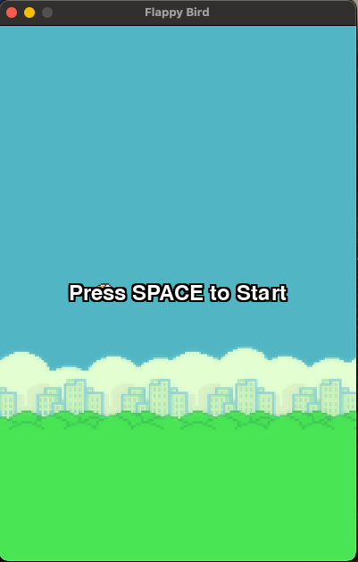

# Flappy Bird (JavaScript)

A web-based version of the classic Flappy Bird game, built with HTML5 Canvas and JavaScript. Navigate the bird through a series of pipes by flapping its wings, aiming for the highest score possible!

**[Play it live here!](https://gvnghiem.github.io/flappybird-js/flappybird.html)** 

## Features
- **Gameplay**: Tap or press `SPACE` to flap the bird and avoid pipes.
- **Graphics**: Uses a sprite sheet for background, bird animations, and pipes.
- **Sound**: Includes sound effects for flapping, hitting pipes, scoring, and game over.
- **Responsive**: Works in modern browsers with a simple, centered canvas layout.
- **States**: Idle (start screen), Playing, and Game Over modes.

## Screenshots


## Setup

### Prerequisites
- A modern web browser (Chrome, Firefox, Safari, etc.).
- Git (optional, for cloning locally).
- A local server (optional, for testing before deployment).

### Files
- `flappybird.html`: The main game file with inline JavaScript.
- `spritesheet.png`: Sprite sheet containing background, bird frames, and pipe images.
- `die.mp3`, `hit.mp3`, `flap.mp3`, `point.mp3`: Sound effects for game events.

### Local Testing
1. Clone or download this repository:
   ```bash
   git clone https://github.com/gvnghiem/flappybird-js.git
   cd flappybird-js
